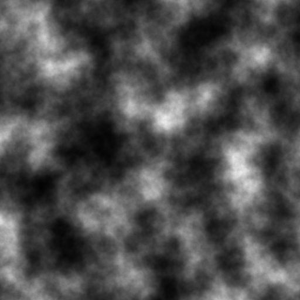
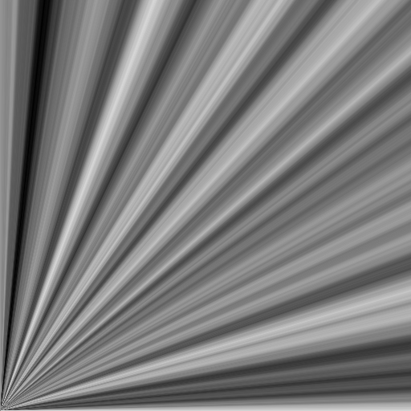
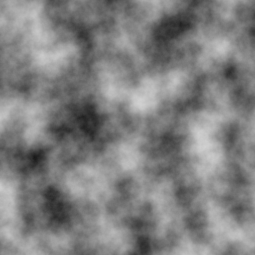

# ANoise

> 这是一个模块化的高性能复杂噪声生成库，支持生成2D，3D，4D，6D噪声，用于Unity，使用Jobsystem和Burst编译器。

​ANoise从Joshua Tippetts的C++库[Accidental Noise Library](https://accidentalnoise.sourceforge.net/)改编，重写了大部分代码以适应JobSystem，噪声算法大都保持一致，将Hash算法改为Catlike Coding在[此处](https://catlikecoding.com/unity/tutorials/pseudorandom-noise/hashing/)描述的Small xxHash以优化性能。

## Modules

​提供了各种模块来生成、修改、组合和转换函数产生复杂的输出。

### ModuleFractal

EInterpTypes

<table>
    <tr>
        <td align="center"></td>
        <td align="center"></td>
        <td align="center"></td>
        <td align="center"></td>
    </tr>
    <tr>
        <td align="center">NONE</td>
        <td align="center">LINEAR</td>
        <td align="center">CUBIC</td>
        <td align="center">QUINTIC</td>
    </tr>
</table>


EBasisTypes

<table>
    <tr>
        <td align="center"></td>
        <td align="center"></td>
        <td align="center"></td>
        <td align="center"></td>
        <td align="center"></td>
    </tr>
    <tr>
        <td align="center">VALUE</td>
        <td align="center">GRADIENT</td>        
        <td align="center">GRADVAL</td>        
        <td align="center">SIMPLEX</td>        
        <td align="center">WHITE</td>        
    </tr>
</table>

EFractalTypes

<table>
    <tr>
        <td align="center"></td>
        <td align="center"></td>
        <td align="center"></td>
    </tr>
    <tr>
        <td align="center">FBM</td>
    	<td align="center">RIDGEDMULTI</td>
    	<td align="center">BILLOW</td>
    </tr>
    <tr>
        <td align="center"></td>
    	<td align="center"></td>
	<td align="center"></td>
    </tr>
    <tr>
        <td align="center">MULTI</td>
    	<td align="center">HYBRIDMULTI</td>
	<td align="center">DECARPENTIERSWISS</td>
    </tr>
</table>

### ModuleCellular

<table>
    <tr>
        <td align="center"></td>
        <td align="center"></td>
        <td align="center"></td>
    </tr>
    <tr>
        <td align="center">F1=1</td>
        <td align="center">F2=1</td>
        <td align="center">F1=-1,F2=1</td>
    </tr>
</table>

### ModuleConstant

​ModuleConstant是一个代表常量的模块，在计算中，ModuleConstant为所有采样返回相同的值。

### ModuleAutoCorrect

​ModuleAutoCorrect用来将噪声值映射到合理的范围内，ModuleAutoCorrect通过对设定的源模块进行大量随机采样来估计源模块输出的最大值和最小值，映射函数本身非常快速，但随机采样需要一些时间，通常应该只在预算充裕时调用ModuleAutoCorrect.Build()来初始化一次。

### ModuleBias

<table>
    <tr>
        <td align="center"></td>
        <td align="center"></td>
        <td align="center"></td>
    </tr>
    <tr>
        <td align="center">Source</td>
        <td align="center">Bias=0.25</td>
        <td align="center">Bias=0.75</td>
    </tr>
</table>

### ModuleBlend

<table>
    <tr>
        <td align="center"></td>
        <td align="center"></td>
        <td align="center"></td>
    </tr>
    <tr>
        <td align="center">Control</td>
        <td align="center">Low=0,High=0.25</td>
        <td align="center">Low=0.25,High=0.75</td>
    </tr>
</table>

### ModuleBrightContrast

​ModuleBrightContrast提供了一种调整图像亮度和对比度的方法。对比度是相对于指定阈值进行调整的。大于阈值的值向上调整（更亮），而低于阈值的值向下调整（更暗）。

<table>
    <tr>
        <td align="center"></td>
        <td align="center"></td>
        <td align="center"></td>
    </tr>
    <tr>
        <td align="center">Source</td>
        <td align="center">Threshold=0,Factor=2</td>
        <td align="center">Threshold=1,Factor=2</td>
    </tr>
</table>


### ModuleCache

​ModuleCache提供了一个容器来存储一组值，在需要多次计算复杂噪声时可以使用缓存而不是每次都进行计算，ModuleCache希望缓存长度与请求长度一致，没有关于容器长度的安全检查，必须在使用时确保这一点。

### ModuleClamp

<table>
    <tr>
        <td align="center"></td>
        <td align="center"></td>
        <td align="center"></td>
    </tr>
    <tr>
        <td align="center">Source</td>
        <td align="center">Low=0.2,High=0.8</td>
        <td align="center">Low=0.5,High=0.8</td>
    </tr>
</table>

### ModuleCos

<table>
    <tr>
        <td align="center"></td>
        <td align="center"></td>
    </tr>
    <tr>
        <td align="center">Source</td>
        <td align="center">Cos</td>
    </tr>
</table>

### ModuleFloor

<table>
    <tr>
        <td align="center"></td>
        <td align="center"></td>
    </tr>
    <tr>
        <td align="center">Source</td>
        <td align="center">Floor</td>
    </tr>
</table>

### ModuleFunctionGradient

<table>
    <tr>
        <td align="center"></td>
        <td align="center"></td>
        <td align="center"></td>
    </tr>
    <tr>
        <td align="center">Source</td>
        <td align="center">X_AXIS</td>
        <td align="center">Y_AXIS</td>
    </tr>
</table>

### ModuleGain

<table>
    <tr>
        <td align="center"></td>
        <td align="center"></td>
        <td align="center"></td>
    </tr>
    <tr>
        <td align="center">Source</td>
        <td align="center">Gain=0.25</td>
        <td align="center">Gain=0.75</td>
    </tr>
</table>

### ModuleGradient

<table>
    <tr>
        <td align="center"></td>
        <td align="center"></td>
        <td align="center"></td>
        <td align="center"></td>
    </tr>
    <tr>
        <td align="center">1,0,0,0</td>
        <td align="center">0,1,0,0</td>
        <td align="center">0,0,1,0</td>
        <td align="center">0,0,0,1</td>
    </tr>
</table>

### ModuleMagnitude

<table>
    <tr>
        <td align="center"></td>
        <td align="center"></td>
        <td align="center"></td>
    </tr>
    <tr>
        <td align="center">Source</td>
        <td align="center">Y=0.25</td>
        <td align="center">Y=0.75</td>
    </tr>
</table>

### ModuleNormalizeCoords

<table>
    <tr>
        <td align="center"></td>
        <td align="center"></td>
        <td align="center"></td>
        <td align="center"></td>
    </tr>
    <tr>
        <td align="center">Source</td>
        <td align="center">Length=1</td>
        <td align="center">Length=10</td>
        <td align="center">Length=100</td>
    </tr>
</table>

### ModulePow

<table>
    <tr>
        <td align="center"></td>
        <td align="center"></td>
        <td align="center"></td>
    </tr>
    <tr>
        <td align="center">Source</td>
        <td align="center">Pow=0.25</td>
        <td align="center">Pow=0.75</td>
    </tr>
</table>

### ModuleRotateDomain

<table>
    <tr>
        <td align="center"></td>
        <td align="center"></td>
        <td align="center"></td>
    </tr>
    <tr>
        <td align="center">Source</td>
        <td align="center">Angle=0.25</td>
        <td align="center">Angle=0.75</td>
    </tr>
</table>

### ModuleSawtooth

<table>
    <tr>
        <td align="center"></td>
        <td align="center"></td>
        <td align="center"></td>
    </tr>
    <tr>
        <td align="center">Source</td>
        <td align="center">Period=0.25</td>
        <td align="center">Period=0.75</td>
    </tr>
</table>

### ModuleScaleDomain

<table>
    <tr>
        <td align="center"></td>
        <td align="center"></td>
        <td align="center"></td>
        <td align="center"></td>
    </tr>
    <tr>
        <td align="center">Source</td>
        <td align="center">X=0.25,Y=1</td>
        <td align="center">X=1,Y=0.25</td>
        <td align="center">X=0.5,Y=0.5</td>
    </tr>
</table>

### ModuleScaleOffset

<table>
    <tr>
        <td align="center"></td>
        <td align="center"></td>
    </tr>
    <tr>
        <td align="center">Source</td>
        <td align="center">Scale=0.5,Offset=0.5</td>
    </tr>
</table>

### ModuleSelect

<table>
    <tr>
        <td align="center"></td>
        <td align="center"></td>
        <td align="center"></td>
    </tr>
    <tr>
        <td align="center">Source1</td>
        <td align="center">Source2</td>
        <td align="center">Select</td>
    </tr>
</table>

### ModuleSin

<table>
    <tr>
        <td align="center"></td>
        <td align="center"></td>
    </tr>
    <tr>
        <td align="center">Source</td>
        <td align="center">Sin</td>
    </tr>
</table>

### ModuleSphere

<table>
    <tr>
        <td align="center"></td>
    </tr>
    <tr>
        <td align="center">CX=0.5,CY=0.5,R=0.5</td>
    </tr>
</table>

### ModuleTiers

<table>
    <tr>
        <td align="center"></td>
        <td align="center"></td>
        <td align="center"></td>
    </tr>
    <tr>
        <td align="center">Source</td>
        <td align="center">NumTiers=5,Smooth=false</td>
        <td align="center">NumTiers=5,Smooth=true</td>
    </tr>
</table>

### ModuleTranslateDomain

<table>
    <tr>
        <td align="center"></td>
        <td align="center"></td>
        <td align="center"></td>
    </tr>
    <tr>
        <td align="center">Source</td>
        <td align="center">X=1,Y=0</td>
        <td align="center">X=0,Y=1</td>
    </tr>
</table>

### ModuleTriangle

<table>
    <tr>
        <td align="center"></td>
        <td align="center"></td>
        <td align="center"></td>
    </tr>
    <tr>
        <td align="center">Source</td>
        <td align="center">Period=0.25,Offset=1</td>
        <td align="center">Period=0.75,Offset=1</td>
    </tr>
    <tr>
        <td align="center"></td>
        <td align="center"></td>
        <td align="center"></td>
    </tr>
    <tr>
        <td align="center">Period=1,Offset=0.25</td>
        <td align="center">Period=1,Offset=0.75</td>
        <td align="center">Period=1,Offset=1</td>
    </tr>
</table>

### ModuleAdd,ModuleSub,ModuleMult,ModuleDiv

​这些模块提供了对所有模块的加减乘除操作，并实现了相应的扩展以方便的对模块进行数学运算，对于r = ((v1 + v2 + v3 - v4) * v5) / v6，

```c#
ModuleBase v1, v2, v3, v4, v5, v6;
```

以下两种方法相同

```c#
ModuleAdd step1 = new ModuleAdd()
            .SetSource1(v1)
            .SetSource2(v2)
            .Build();
ModuleAdd step2 = new ModuleAdd()
            .SetSource1(step1)
            .SetSource2(v3)
            .Build();
ModuleSub step3 = new ModuleSub()
            .SetSource1(step2)
            .SetSource2(v4)
            .Build();
ModuleMult step4 = new ModuleMult()
            .SetSource1(step3)
            .SetSource2(v5)
            .Build();
ModuleDiv step5 = new ModuleDiv()
            .SetSource1(step4)
            .SetSource2(v6)
            .Build();
```

```c#
ModuleBase r = ((v1 + v2 + v3 - v4) * v5) / v6;
```

### ModuleMax,ModuleMin

​这些模块从两个模块中比较采样值的大小，从中选择较大/小的那个作为输出。

## 性能参考

用于测试的噪声参数为Octaves=8，BasisType=SIMPLEX，FractalType=FBM，InterpType=QUINTIC，并且关闭Burst安全检查，这基本可以代表在大多数场景的性能消耗，其他选项大都更快或者相仿，只有在FractalType=DECARPENTIERSWISS时要慢的多，因为DECARPENTIERSWISS通过对坐标偏移进行多次采样。

| 采样数    | 用时（ms） |
| --------- | ---------- |
| 64*64     | 0.209      |
| 128*128   | 0.48815    |
| 256*256   | 1.59006    |
| 512*512   | 5.93459    |
| 1024*1024 | 23.2001    |
| 2048*2048 | 91.1537    |
| 4096*4096 | 370.2356   |
| 8192*8192 | 1425.3642  |

## 安装

- 下载或克隆此存储库复制到您的项目文件夹中

- 在`Package Manager`中选择`Add Package form git URL`，使用以下链接

  ```
  https://github.com/zhl-dru/ANoise.git
  ```
  
## 依赖项
- `com.unity.burst` 1.6.6+
- `com.unity.collections` 1.4.0+
- `com.unity.mathematics` 1.2.6+

## 扩展

自定义模块非常简单，只需要继承`ModuleBase`并实现所有`Get`方法，这些`Get`方法分别对应2/3/4/6D采样值，以2D为例：

```c#
public class MyModule : ModuleBase
{
    public override JobHandle Get(NativeArray<double2> inputs, NativeArray<double> outputs, JobHandle dependsOn = default)
    {
		
    }
}
```

在内部，`Get`方法希望安排一个作业链，并返回最后一个作业的句柄，在方法内，应该安排一个作业来运行实际的算法，将结果值存储在参数`outputs`中，返回这个作业的句柄，另外，`inputs`和`outputs`的长度应该总是相同的。

```c#
public class MyModule : ModuleBase
{
    private ModuleBase m_source1;
    private ModuleBase m_source2;
    
    public override JobHandle Get(NativeArray<double2> inputs, NativeArray<double> outputs, JobHandle dependsOn = default)
    {
	int length = inputs.Length;
        var cache1 = CreateCache<double>(length);
        var cache2 = CreateCache<double>(length);

        var source1job = m_source1.Get(inputs, cache1, dependsOn);
        var source2job = m_source2.Get(inputs, cache2, source1job);

        var job = new MyJob
        {
		inputs1 = cache1, 
		inputs2 = cache2, 
		outputs = outputs
        }.Schedule(length, length / Constant.JobBatchCount, source2job);
        
        DisposeCache(job, cache1, cache2);
        return job;
    }
}
public struct MyJob : IJobParallelForBatch
{
    public NativeArray<double> inputs1;
    public NativeArray<double> inputs2;
    public NativeArray<double> outputs;

    public unsafe void Execute(int startIndex, int count)
    {
	// ......
    }
}
```

​需要注意的是，首先要确保所有的模块通过工作链连接在一起，其次，在方法最终返回之前，所有用来临时缓存的`NativeArray`要标记释放，ModuleBase中提供了`CreateCache`和`DisposeCache`来方便的做到这一点，它们只是new NativeArray<T>(length, Allocator.TempJob) 和 NativeArray<T>.Dispose(JobHandle inputDeps)的包装。

ANoise提供了7个通用的Job在简单的组合时使用，以避免大量模板代码，这些Job包括`AlgorithmA1Job`，`AlgorithmA2Job`，`AlgorithmA3Job`，`AlgorithmA4Job`，`AlgorithmA5Job`，`AlgorithmA6Job`，`AlgorithmA7Job`以及相应的委托`algorithm_a1`，`algorithm_a2`，`algorithm_a3`，`algorithm_a4`，`algorithm_a5`，`algorithm_a6`，`algorithm_a7`，这些通用Job都是通过`IJobParallelForBatch`和函数指针实现的，`ModuleAdd`,`ModuleSub`,`ModuleMult`,`ModuleDiv`等模块很好的展示这些通用Job的用法。

​对于更复杂的组合方法，例如首先对坐标进行偏移再采样的类似办法，必须编写专用的Job，其余事项与上述一致。

## 注意事项

- 已经实现的所有Job都是IJobParallelForBatch，`Constant.JobBatchCount`定义了IJobParallelForBatch运行的最大批次数，预设的值为16，对于不同的硬件，可以取得更高性能的值不同，通常8，16，32，64是常见的，由于使用了一些函数指针，`Constant.JobBatchCount`的数值应该尽可能的小，但小于8的值反而会更慢。
- 许多地方使用函数指针来减少大量的模板代码，但应该注意，函数指针的调用相当慢，假设使用IJobFor，同样的条件下Job的执行速度慢于简单使用C#的单线程循环，在IJobParallelForBatch中适当的使用方法使函数指针只调用最多`Constant.JobBatchCount`次，对于非常少的采样数，这依然是很大的开销，不建议每次采样小于64*64个值。
